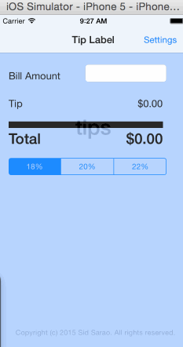

# tip_calculator

Time spent: Approx 8 + hours ; mostly on the setting page

Completed:

[Y] Required: User can enter a bill amount, choose a tip percentage, and see the tip and total values.
[Y] Required: Settings page to change the default tip percentage.

Walkthrough of all user stories:

GIF created with [LiceCap](http://www.cockos.com/licecap/).
